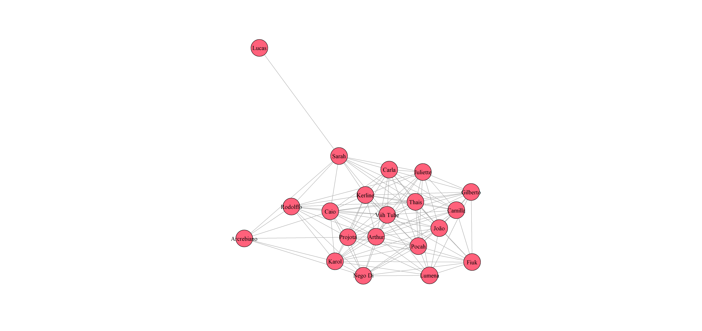
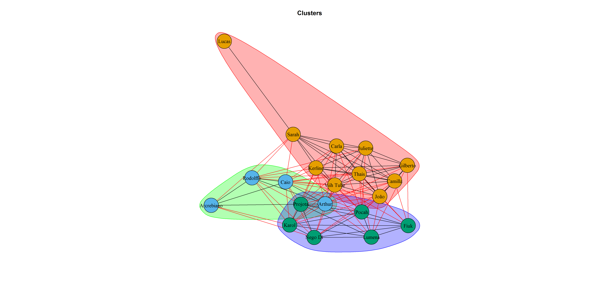
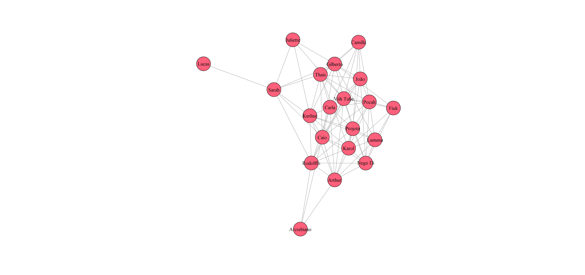
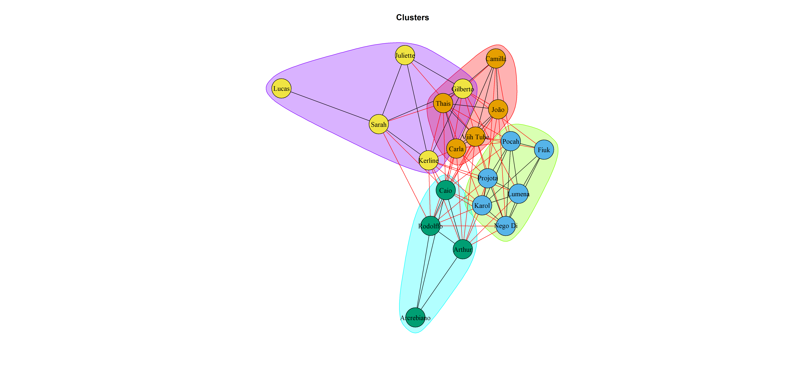
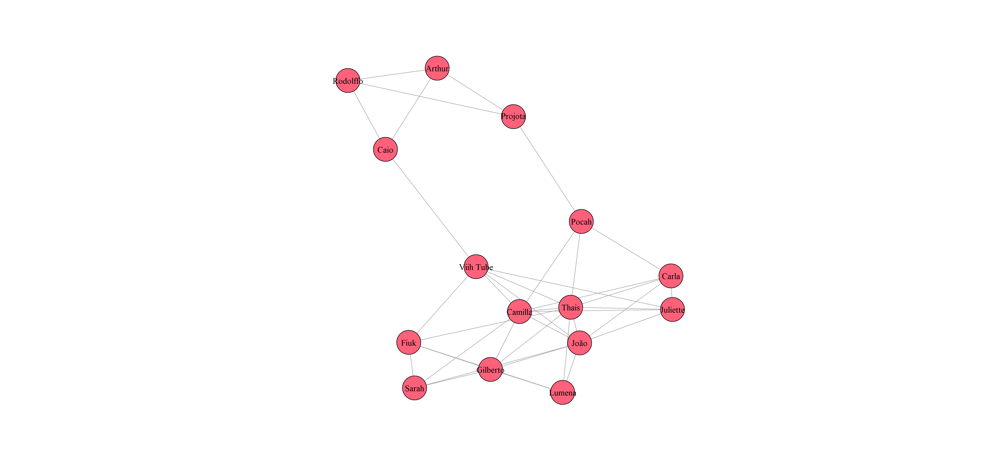
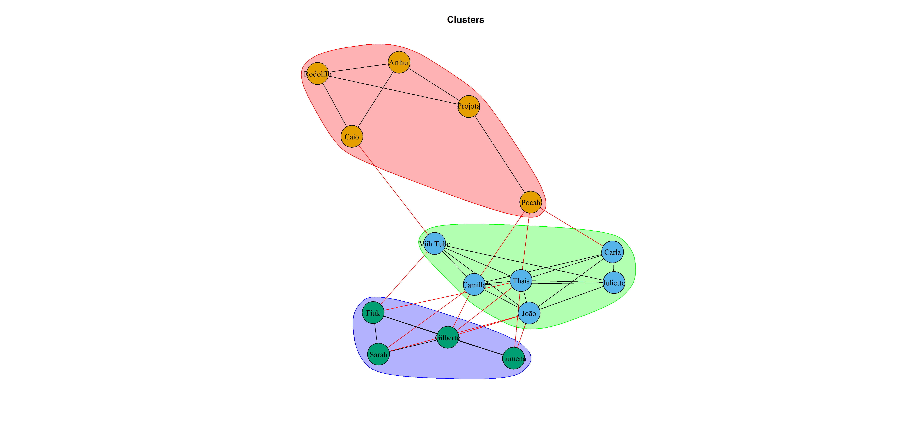

# RedeSocialBBB21.queridometro

<!-- badges: start -->
<!-- badges: end -->

O objetivo desse projeto foi investigar as relações sociais no BBB 21 através dos dados do queridômetro. Os dados foram coletados do site [gshow](https://gshow.globo.com/realities/bbb/bbb21/feed-bbb/), no feed BBB.

## Método
Para analisar os dados do queridômetro, foi usado o seguinte método: caso a pessoa desse um coração, era adicionado um ponto no escore dessas duas pessoas; sorrisos valiam 0 pontos; qualquer outro emoji (que são representativos de emoções negativas) era considerado -1 ponto no escore. Sendo assim, um participante vai ter um escore para um outro participante e esse outro participante vai ter um escore para o primeiro participante. Por exemplo, o escore de Gilberto para Juliette vai ser de acordo com o que Gilberto escolheu no queridômetro para Juliette, e as escolhas de Juliette sobre Gilberto no queridômetro também irão computar um escore. Obviamente os escores não serão similares. Logo, foi calculada a média entre os dois escores para computar a força do escore entre os participantes. Se o escore de Gilberto para Juliette foi 70 e o escore de Juliette para Gilberto foi 80, o escore da relação Gilberto-Juliette será de 75, e esse escore da relação é o que foi usado para calcular as conexões que foram consideradas ou não.

Por conta dos diferentes tempos de participação no queridômetro (e.g., Kerline teve 5 dias; Camilla, Gilberto, Juliette e Fiuk tiveram 93 dias), o escore foi equalizado pelo número de dias na casa. Dessa forma, mesmo com o participante tendo sido eliminado, o escore terá o mesmo peso. Isso foi feito para evitar distorões, tendo em vista que participantes com mais tempo de casa vão ter mais relações.

Os dados foram analisados em três níveis: dados gerais; dados da "primeira temporada" (até a saída da participante Karol Conka); dados da "segunda temporada" (até a saída do participante Rodolffo). Não foram analisados os dados depois da eliminação do Rodolffo porque em grande parte foram distribuídos corações entre os participantes, o que faz com que exista conexões entre todos os participantes e a análise seja pouco útil.

Para cada nível de análise foi usado um ponto de corte diferente e arbitrário para representar as conexões. Além disso, foram usados algorítmos de identificação de clusters diferentes em cada nível. Para mais informações, ver o script de [análise](data-raw/analysis_social-network.R).

## Resultados

Na sequência apresento os resultados obtidos através das análises. Primeiramente apresentarei os dados gerais, contemplando todo o queridômetro, do começo (28/01/2021) até o dia 01/05/2021. Em seguida, será apresentado os dados da "primeira temporada", tendo inserido os dados do dia 28/01/2021 até o dia 23/02/2021, data em que a participante Karol Conka foi eliminada. Por fim, será apresentado os dados da "segunda temporada", onde serão apresentados os dados do dia 24/02/2021 (um dia após a eliminação da participante Karol Conka) até o dia 06/04/2021, data em que o participante Rodolffo foi eliminado.

### Dados gerais

Uma das coisas mais interessantes de se notar é quem são os personagens mais no centro. Esses são os participantes que tiveram mais relações positivas. Não surpreendentemente, a jogadora Viih Tube foi a personagem mais central. Outro ponto extremamente chamativo é como o participante Lucas está afastado de todo o resto da casa. Em suas conexões, o único escore que ficou acima do ponto de corte foi com a Sarah. Logo, mesmo com os dados do queridômetro é possível perceber que tal participante estava sofrendo forte exclusão. Além disso, nota-se o participante Arcrebiano numa posição também periférica. Isso se dá pelo baixo número de relações encontrados no escore do queridômetro. Esse resultado partilha de validade real tendo em vista que ele foi um dos participantes mais votados da edição mesmo tendo ficado na casa apenas duas semanas.

Usando uma análise de identificação de Clusters é possível encontrar clusters bastante similares aos que os fãs mencionavam. As bolinhas verdes (dentro do sombreado azul) representam os jogadores que fizeram parte do chamado "Grupão". Um segundo grupo, com bolinhas azúis (dentro de um sombreamento verde claro) foi encontrado. Nesse grupo, encontram-se Arcrebiano, Rodolffo, Caio e Arthur. Esses jogadores, em especial os bastiões, tiveram um jogo mais fechado, e isso foi encontrado dentro dessa análise. Por fim, o gruplo das bolinhas laranjas com sombreamento vermelho representa parte do que era chamado de centrão e o G3. 

### Primeira temporada

Os dados da primeira temporada apresentam alguma similaridade com os dados gerais do programa. Nota-se novamente Lucas totalmente distante do resto do grupo, endo apenas uma conexão com Sarah. Arcrebiano, também distante, mas também é possível notar Juliette deslocada. Nesse início de programa, Juliette foi excluída por diversos participantes, o que valida os dados encontrados. Sarah também é um personagem mais a periferia, e possivelmente isso ocorreu por ela ter sido a protagonista naquele momento, defendendo Lucas e indo contra o "Grupão".

Ao fazer a análise de clusters não-supervisionado encontramos uma divisão bastante interessante e um tanto similar com a dos fãs. Primeiramente, é possível notar o "grupão", representado em bolinhas azuis com sombreamento verde claro. Em segundo, é possível ver o "centrão" composto por dois agrupamentos: o dos bastiões (junto de Arthur e Arcrebiano), representado em bolas verdes com sombreamento azul claro; e o grupo que foi apelidado por alguns fãs de "jardim botânico", representado em bolas laranjas com sombreamento vermelho. Por fim, um quarto Cluster é encontrado, representativo do G3. Esse cluster está marcado em bolas amarelas com sombreamento roxo. Nesse grupo encontra-se o G4 original (Sarah, Juliette, Gilberto e Lucas), mas o algoritmo também identificou Kerline nesse grupo. O resultado inesperado com kerline pode ter ocorrido devido aos poucos dados que ela teve (apenas 5 dias).

### Segunda temporada

A segunda temporada do programa se iniciou após a eliminação da participante Karol Conka. Nesse momento, o G3 e o que restou do grupão decidiram apaziguar os animos e começar a envolver o "centrão" no jogo também. Com isso, houve uma mudança na dinâmica social da casa.

Nesse segundo momento da dinâmica da casa é possível ver uma dinâmica bem diferente da primeira temporada. Há um grupo mais conectado e um grupo que acabou ficando mais excluído entre si. Quem fez a ponte entre os grupos foi basicamente a jogadora Viih Tube e a participante Pocah. Outros participantes, como a Lumena, acabaram ficando mais desconectados por conta do fim do "Grupão". 

Ao realizar a análise de clusters nesses dados, são encontrados três clusters. O primeiro, é um cluster composto por Fiuk, Gilberto, Sarah e Lumena. Esse cluster emergiu do rompimento do G3. Tal cluster pode ser encontrado nas bolinhas verdes com sombra azul. Um segundo Cluster encontrado continua sendo o "centrão", mas dessa vez com a adição de Juliette, que foi excluída do G3. Esse cluster está representado nas bolas de cor azul com sombra verde claro. Por fim, um terceiro cluster também foi encontrado. Esse cluster é a união dos bastiões com o que sobrou do Grupão. Tal cluster está colorido nas cores laranja e vermelha. 

## Conclusão

É interessante notar como os dados do queridômetro podem indicar as relações sociais entre os participantes da casa. Mais interessante, é que com esses dados é possível constatar as relações que grande parte do público notou. Sendo assim, grande parte das tramas do programa foi levada para dentro do queridômetro da casa.
